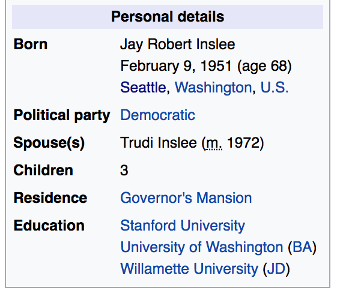

<br> 
<center></center>


## Course: Data-Driven Management and Policy

### Prof. José Manuel Magallanes, PhD 

_____

# Session 3 LAB: Data Structures


#Lab Instructions

This lab is designed to give you practice manipulating basic R data structures. In addition, it should give you more practice using R and Markdown.

## Part 1: Working with lists

You have this information from Governor Inslee:



The information was got from [wikipedia](https://en.wikipedia.org/wiki/Jay_Inslee). 

Make a list, in a way you can answer these questions:

* How old is he? (compute it from his birthday)
* How long has he been married?
* How many Universities has he attended?
* In what state was he born?

Write the code to answer those questions.

## Part 2: Solving Data issues

Last session you were asked to get some data from SEATTLE OPEN DATA portal. I will show you an example on how to use R to look for and solve some issues.

### EXAMPLE:

1. Open the data:

```{r}
linkToData='ExampleLab3.xlsx'

library(rio)

myData=import("ExampleLab3.xlsx")
```

2. Verify the data type:

```{r}
str(myData)
```

3. Identify problems

From the result above, age and household size should be numbers, but they have been read as text; that is, there should be a number written as text.

4. Count missing values in numeric data:

```{r}
myData[is.na(myData$age),]
```

```{r}
myData[is.na(myData$HouseholdSize),]
```

Each column has one missing value.

5. Count missing values in numeric data when turned into numeric:

```{r}
myData[is.na(as.numeric(myData$age)),]
```

In the previous case, when turning the column into numeric no extra missing value was found.


```{r}
myData[is.na(as.numeric(myData$HouseholdSize)),]
```

In the previous case, when turning the column into numeric ONE extra missing value was found. In this case, R also told you that it introduced NAs. When you apply the function _as.numeric()_ to a text, R will return a NA. 

6. Make replacements

In the first column, there were no issues, then I simply alter the data type:
```{r}
myData$age=as.numeric(myData$age)
```

In the second column, you first need to modify the value:

```{r}
myData$HouseholdSize[18]
```

```{r}
# then:
myData$HouseholdSize[18]=1
```

Now you can turn the column into numbers:
```{r}
myData$HouseholdSize=as.numeric(myData$HouseholdSize)
```

7. Make a statistical summary of the numeric variables
```{r}
summary(myData[,c('age','HouseholdSize')])
```

8. Identify weird values

In the previous summary, you see that age values seem well, but it looks as though there might be something weird in household size: there is a person in this data set whose household size is 44. Is this an outlier?

```{r}
boxplot(myData$HouseholdSize,horizontal = T)
```

It looks too far from the other answers. As it is an **integer** value (do not do this if it has decimal values), we could try a frequency table:
```{r}
table(myData$HouseholdSize)
```

My best guess is that this value is atually a _4_, so there is some kind of mistyping; however, you might want to spend some time looking for the original record that produced this row.

### YOUR TURN:

* Use the data you downloaded last week.
* Using **str()**, verify if there is a numeric value that has been read as text. If so, please modify it. If there were several numeric columns, do not use more than three.
* Identify if there are weird values in the numeric columns (now all re formatted). If there were several numeric columns, do not use more than three.


## Part 3: Final Project

* Specify what action or intervention you will begin in two weeks as your experiment. 
* Which of your measures do you expect to see a difference in based on that experiment (you can see it in multiple)?
* What is your hypothesis, do you think that measure will increase or decrease? It is recommended that you begin your data collection by tonight, although in the next few days will also work.


----

* [Go to page beginning](#beginning)
* [Go to Course schedule](https://ds4ps.org/ddmp-uw-class-spring-2019/schedule/)
