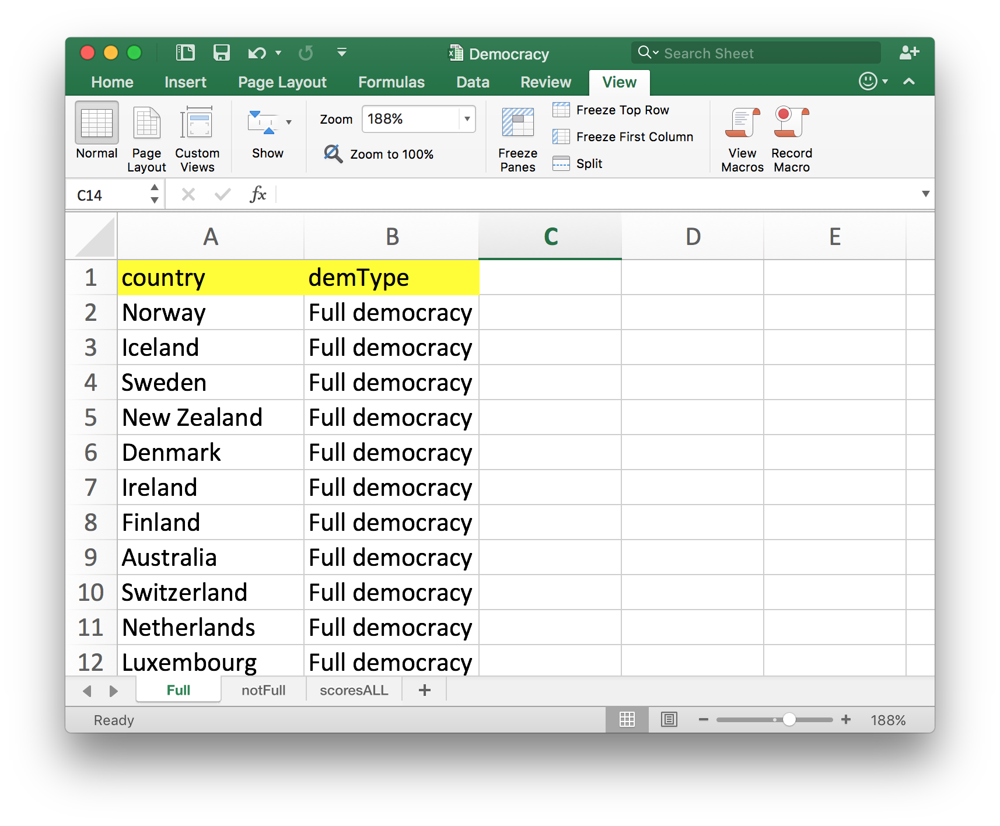
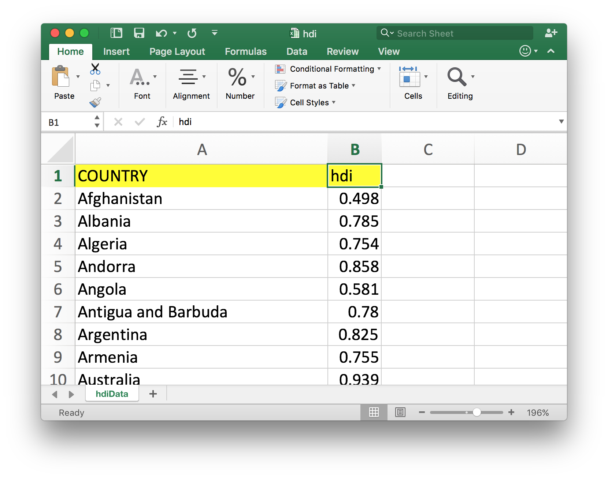

<br> 
<center></center>


## Course: Data-Driven Management and Policy

### Prof. José Manuel Magallanes, PhD 

_____


# Session 4: Working with Data Frames

<a id='beginning'></a>


The data frame is a common data structure for people with experience with spreasheets or data tables. It is just that: a collection of rows with several columns. However, each software application has its own way of dealing with data frames.

In this session, we will learn the main strategies that we use to deal with data frames:

1. [Logical Operators.](#part1) 
2. [Control of Execution.](#part2) 
3. [Functions.](#part3) 

----

<a id='part1'></a>

## Logical Operators

Let me open a simple data frame from an Excel file:
```{r, eval=TRUE,warning=FALSE}
library(rio)
fileName='people.xlsx'
people=import(fileName) # table '1'
people
```


The first step is making sure of what data types you have:

```{r, eval=TRUE}
str(people)
```

Education is represented as a number, let me turn it into a category:

```{r, eval=TRUE}
people$education=factor(people$education,
                        levels=c(1,2,3),
                        labels=c("Low","Medium","High"),
                        ordered = T)
```


The purpose of logical operatos can be divided into:

* DETECTING COMPLIANCE

**How many people are older that 30?**
```{r, eval=TRUE}
# count:
sum(people$ages>30)
```
```{r, eval=TRUE}
# count:
nrow(people[people$ages>30,])
```
```{r, eval=TRUE}
#count:
table(people$ages>30)
```

```{r, eval=TRUE}
# percent:
mean(people$ages>30)
```

```{r, eval=TRUE}
# percent:
nrow(people[people$ages>30,])/nrow(people)
```
```{r, eval=TRUE}
# percent:
prop.table(table(people$ages>30))
```


* SUBSETTING 


**Case 1: selecting rows**

```{r, eval=TRUE}
#People from WA

condition=c("WA")
people[people$state %in% condition,]
```

```{r, eval=TRUE}
#People from WA and NY

condition=c("WA","NY")
people[people$state %in% condition,]
```


```{r, eval=TRUE}
#top two highest levels

condition=c("Medium","High")
people[people$education %in% condition,]

```

```{r, eval=TRUE}
#top two highest levels

people[people$education >= "Medium",] # valid for ordinal factors
```

The logical operator ">=" can not be used in text, or nominal variables, as they do not have order.


```{r, eval=TRUE}
#People aged 37 OR 25

condition=c(37,25)
people[people$ages %in% condition,]

```

```{r, eval=TRUE}
#People older than 35

condition=35
people[people$ages > condition,]

```


```{r, eval=TRUE}
# the youngest person/people

condition=min(people$ages)
people[people$ages==condition,] 
```

```{r, eval=TRUE}
# compare
people[which.min(people$ages),] 
```

**Multiple conditions** bring the challenge of dealing with several data types:

```{r, eval=TRUE}
# older than 35 OR younger than 27
people[people$ages>35 | people$ages<27,]
```

```{r, eval=TRUE}
# younger than 27 WITH education level Medium
people[people$ages<27 & people$education=="Medium",]
```

```{r, eval=TRUE}
# younger than 30 WITH education level 2 or 3
condition=c("Medium","High")
people[people$ages<30 & people$education %in% condition,]
```

```{r, eval=TRUE}
# older than 30 WITH education level 2 OR 3 FROM NY

people[ people$ages>30& 
           people$education %in% condition &
           people$state=='NY',]
```

R has the **filter()** function which allows the selection of rows in an 'english language' approach:

```{r, eval=TRUE, warning=FALSE, message=FALSE}
library(dplyr)
filter( people, ages > 30 & 
            education %in% condition & 
            people$state=='NY'  )
```


**Case 2: selecting columns**

This is how you can get some columns:

```{r, eval=TRUE}
people[,c('cod','state')] # notice the comma position
```


This can be also done by using **select** (from dplyr)

```{r, eval=TRUE}
select(people, c('cod','state'))
```

Or like this:

```{r, eval=TRUE}
select(people, cod,state)
```

Of course, you can use conditions for rows and columns. 

```{r, eval=TRUE}
# older than 35 OR younger than 27
people[people$ages>35 | people$ages<27,c('cod','state')]
```

You can turn the previous command using the dplyr tools and the **pip** (%>%) operator:

```{r, eval=TRUE}
people %>% filter(ages>35 | ages<27) %>% select(cod,state)
```


**Note on missing values**

It is always a good practice, when you know missing values are present, so that you can anticipate possible unexpected results.

```{r, eval=TRUE}
# current value
people$ages[1]
```

```{r, eval=TRUE}
#turning that value to  missing:
people$ages[1]=NA

# then
people
```

Let me query:
```{r, eval=TRUE}
people[people$ages>27,]
```

What is the row at the top?

Now,

```{r, eval=TRUE}
people[people$ages<=27,]
```

Again the same row appears.

R gave you a row with all missing values. This happens when your query does not control the _NA_. You may want to use this to create your sub data frame:


```{r, eval=TRUE}
people[people$ages>27 & !is.na(people$ages) ,]

```

It is different if the query does not refer to a column with missing values:

```{r, eval=TRUE}
people[people$education=="High",]
```


[Go to page beginning](#beginning)

____

<a id='part2'></a>

## Control of Execution

We will teach soon how to build functions, and for that you may want to have some knowledge on how to program in R. For that, you need to know how you can control the execution of code. This is done via:

* Conditional execution
* Repetitive execution

**CONDITIONAL EXECUTION** is how you tell the computer what part of a code to execute, depending if an event is true or false.

```{r conditionalExec, eval=TRUE}
###### INPUT
value=-100

###### CONDITIONAL EXECUTION

if (value >= 0){ 
  # what to do if condition is TRUE
  rootValue=sqrt(value)
  print (rootValue)
} else {  
  # what to do if condition is FALSE
  print('Sorry, I do not compute square roots of negative numbers')
}
```

Notice the use of **parenthesis** in the condition. Also, the use of **{}**  to enclose the commands. You do not need those curly braces if you have just _one_ command after the condition. If you omitted the whole **else{}** section, the program will still run, but the program will not get a message when the input is invalid.


**REPETITIVE EXECUTION** is how you tell the computer to do something many times (and stop when it has to):

```{r loopPrint, eval=TRUE}
values=c(9,25,100)

for (value in values){ # do this for each value in values
  print(sqrt(value))
}
```

You do not need to show each result, you could save the results.
```{r loopSave, eval=TRUE}
values=c(9,25,100,500)
rootValues=c() # empty vector
for (value in values){
  rootValues=c(rootValues,sqrt(value)) # updating vector
}
```

Then, you see what you saved:
```{r, eval=TRUE}
# to see the results:
rootValues
```

It is evident that combining *loops* and *control of execution*, we can make better programs. For example, this code is not controlling well the process:

```{r loopSave2, eval=TRUE}
values=c(9,25,-100)
rootValues=c()
for (value in values){
  rootValues=c(rootValues,sqrt(value))
}

```
Then,
```{r, eval=TRUE}
# to see the results:
rootValues
```

In the last result, R decided what to do when a negative value was input (it also sent a warning). This one does a better job:

```{r loopSave3, eval=TRUE}
values=c(9,25,-100,144,-72)
rootValuesNew=c()

for (value in values){
  if (value >=0){
    rootValuesNew=c(rootValuesNew,sqrt(value))
  }else {
    print('We added a missing value, negative input detected')
    rootValuesNew=c(rootValuesNew,NA)
  }
}
```

Then,

```{r, eval=TRUE}
# to see the results:
rootValues
```

We are producing an ouput with the same size as input. If we omit the **else** structure, we will produce an output with smaller size than the input. 


You can also use **break** when you consider the execution should stop:

```{r break, eval=TRUE}
values=c(9,25,-100,144,-72)
rootValues=c()
for (value in values){
  if (value <0){
    print('We need to stop, invalid value detected')
    break
  }
  rootValues=c(rootValues,sqrt(value))
}
```

The code above halted the program, but some results were saved:
```{r}
rootValues
```


You can use **next** when you consider the execution should continue:

```{r NEXT, eval=TRUE}
values=list(9,NA,'1000',-100,144,-72)


for (value in values){
  if (is.na(value)){
    print('missing value as input')
    next
  }
  
  if (value <0){
    print('negative value as input')
    next
  }
  
  if (is.character(value)){
    print('char as input')
    next
  }
  rootVal=sqrt(value)
  print(paste(rootVal,'is the root of ',value))
}
```

[Go to page beginning](#beginning)

____
<a id='part3'></a>


## Functions

We build functions to make the code more readable. Functions plus the data structures and control of execution capabilities you saw before will give you the basic tools you need to develop your own programs. 

A function is a three-step process: Input, Transformation, Output. For example, if you need to convert a numeric value from Fahrenheit into Celsius , the input is the value in Fahrenheit, the transformation is the formula, and the output the result of the formula (a value in Celsius).

```{r funcBasic, eval=TRUE}
converterToCelsius=function(valueInFarenheit){ #input
  #transformation
  resultInCelsius= (valueInFarenheit-32)*5/9
  #output
  return (resultInCelsius)}
```

* A function has a name (for example: _converterToCelsius_) to the left of the **=**; 
* then _a definition of the input of the function_ using the reserved word **function**; 
* the _transformation process_ between **{}**; 
* the process  _output_ (for example: _resultInCelsius_), which requires the keyword **return** and **()**. 

You can omit the _return_ command and a function still works; in that case, R will output the last line that was **executed**; I avoid doing that as it impoverishes reading the code. 

Above, we created a function, and after you run it,  R has a new function available:

```{r funcBasicUse, eval=TRUE}
converterToCelsius(100)
```


### The function input

We control the amount of input in a function:
```{r, eval=TRUE}
# this function requires TWO inputs:
XsumY=function(valueX,valueY){
  ###
  resultSum=valueX+valueY
  ###
  return (resultSum)
}
```


The code above receives two values and outputs their sum. You can see how it works this way:
```{r, eval=TRUE}
XsumY(3,10)
```


You can have some inputs with _default_ values:
```{r, eval=TRUE}
riseToPower=function(base,exponent=2){
  #####
  result=1
  if (exponent > 0){
    for (time in 1:exponent){
      result=result*base
    }
  }
  #####
  return(result)
}
```

Since you have a default value in the input arguments, you decide if you give that input or not. Let's see how it works:

```{r, eval=TRUE}
# to the power 2 by default
riseToPower(9) 
```

```{r, eval=TRUE}
# to the power 3
riseToPower(9,3) 
```

```{r, eval=TRUE}
# using argument names does not require order:
riseToPower(exponent=0,base=9)
```


### The function output


Our output has been a single value, but it can be several ones; however, you need the right structure.

```{r, eval=TRUE}
# one input, and several output in simple data structure:
factors=function(number){
    # empty vector that will collect output
    vectorOfAnswers=c()
    
    # for every value in the sequence...
    for (i in 1:number){
        
        #if the remainder of 'number'/'i' equals zero...
        if ((number %% i) == 0){ 
            
            # ...add 'i' to the vector of factors!
            vectorOfAnswers=c(vectorOfAnswers,i)
    }
  }
  return (vectorOfAnswers) # returning  the vector
}
```

Testing:
```{r, eval=TRUE}
factors(20) 
```


### Applying functions to data structures


Imaging you have created a function that takes a value and multiplies it by two, like this:

```{r, eval=TRUE}
double=function(x){
    return (2*x)
    }
```

and you have this vector:

```{r, eval=TRUE}
myVector=c(1,2,3)
```

What will you get here?
```{r, eval=TRUE}
double(myVector)
```

If you use a vector as an input in a function in R, R will apply the function to each element. 

If you use a list of numbers as input:

```{r, eval=TRUE}
myList=list(1,2,3)
```

You get:
```{r, eval=FALSE}
double(myList)
```


...you get an error. In this case, you can use **Map** or **mapply**:

```{r, eval=TRUE}
# Map returns a list, and the input can be a vector or a list
Map(double,myList)
```

You can also use **mapply**:
```{r, eval=TRUE}
# mapply returns a vector, and the input can be a vector or a list
mapply(double,myList)

```

Notice that the outputs are returned in different data structures.

As we use data frames most of the time, pay attention on how you use a function and what you get as result:

```{r, eval=TRUE}
numberA=c(10,20,30,40,50)
numberB=c(6,7,8,9,10)
dataDF=data.frame(numberA,numberB)
dataDF
```

Let's _double_ each value applying the function _directly_ to the data frame:

```{r, eval=TRUE}
double(dataDF)
```


As you saw above, the function _double_ was designed to receive as input a simple value (a number). Then, without effort from your side, R itself decided to apply it to each element in the data frame. 

Try now simple function as **as.character()** :
```{r, eval=TRUE}
as.character(dataDF)
```


I am pretty sure, this is not what you wanted.

You know that it works in one column (but not in a data frame):
```{r, eval=TRUE}
as.character(dataDF$numberA)
```

We can use *Map()*:

```{r, eval=TRUE}
Map(as.character,dataDF)
```

Or the very common **lapply()**:

```{r, eval=TRUE}
lapply(dataDF,as.character)
```

In both cases, the function worked with a data frame as an input; but the output was a list. If you want a data frame as output:

```{r, eval=TRUE}
# selecting columns:
dataDF[,c(1,2)]=lapply(dataDF[,c(1,2)],as.character)

dataDF
```


Then, to get the data frame using **lapply**, you need to specify the columns.

Let me turn the values back to numbers:

```{r, eval=TRUE}
dataDF[,c(1,2)]=lapply(dataDF[,c(1,2)],as.numeric)
```


There are functions that could be applied to columns or rows and get a total from them. Keep in mind that **lapply** applies a function to columns.

```{r, eval=TRUE}
# you are adding the column values here:
as.data.frame(lapply(dataDF,sum))
```

If you need to apply a function by row or by column, the right option is **apply**:
```{r, eval=TRUE}
# you are adding by row:
apply(dataDF,1,sum) # 1 to apply by row (2 for column).
```

Let me use the data frame _people_ to show **tapply**

```{r, eval=TRUE}
tapply(X=people$ages,INDEX=list(people$education),FUN=mean)
```

This function applies a function to X, organised by the variables in INDEX. Then:
```{r, eval=TRUE}
tapply(X=people$ages,
       INDEX=list(people$education,people$state),
       FUN=mean)
```

The results are not data frames. You can get them using:
```{r, eval=TRUE}
people  %>%  
    group_by( education, state )  %>%  
    summarize(mean(ages))  # summarize('means'=mean(ages))
```


### Manipulating the data frame structure

I have two spreadsheets. One has information on the democracy index:



The other one about the Human Development Index:




The first spreadsheet has three tables, _Full_, _notFull_ and _scoresALL_; while the second has only one.

**APPENDING** is when you combine blocks of data that have a similar structure. 

From the first spreadsheet, we can append the first two tables horizontally:

```{r, eval=TRUE}
# read data

full=import("Democracy.xlsx",which = "Full")
notfull=import("Democracy.xlsx",which="notFull")
```

Then,
```{r, eval=TRUE}
all=rbind(full,notfull)
str(all)
```

We can add the last column, by doing a vertical appending:
```{r, eval=TRUE}
# read in
scores=import("Democracy.xlsx",which="scoresALL")
```

First let's see the first rows:
```{r, eval=TRUE}
head(scores)
```

```{r, eval=TRUE}
head(all)
```

We can not append vertically if the size or order are different. In this case, the order is.

Then,
```{r, eval=TRUE}
all=arrange(all, country) 
scores=arrange(scores, country) 
```

This has sorted BOTH data frames by the column country.

Now you can do:

```{r, eval=TRUE}
demo=cbind(all,scores)
```

However...
```{r, eval=TRUE}
head(demo,10)
```

This appending produced a repeated column. Then,
```{r, eval=TRUE}
demo=demo[,-c(3)] # without the third.
```

Now let me get the other data frame:
```{r, eval=TRUE}
hdi=import("hdi.xlsx")
str(hdi)
```

**MERGING** has the goal of integrating two data frames that have a common column, the _key_. Merging will not produced a repeated column, as _cbind_ did. 

Let's do it:

```{r, eval=TRUE}
demo_hdi=merge(demo,hdi,by.x = 'country', by.y = 'COUNTRY')
head(demo_hdi)
```

Notice some details:

1. One of the _key_ columns dissappeared, as it becomes redundant.

2. You do not use _cbind_ this time, because data comes from different sources, and that you are not sure the _key_ columns are the same.

3. The democray data had 167 rows, and the hdi 190. But the merge produces 161 rows. Those are the countries from demo that found a country with hdi in the second data frame.

From the last point, let's try to keep all countries from both files:
```{r, eval=TRUE}
ALLALL=merge(demo,hdi,by.x = 'country', by.y = 'COUNTRY',
             all.x = T, all.y = T)
```

This one has 196 countries. This means that there are countries in one data set that are not present in the other. These are the countries that are not present in the DEMOCRACY data frame:

```{r, eval=TRUE}
ALLALL[!complete.cases(ALLALL$hdi),"country"]
```

These are the countries that are not present in the HDI data frame:
```{r, eval=TRUE}
ALLALL[!complete.cases(ALLALL$demScore),"country"]
```

In both cases, you see that there are countries or territories that are not common. But also you see that the CONGO countries are present in both countries, but are written differently.

**RESHAPING** is the process of turning the data frame from wide format to long format, and viceversa. So far we have used only wide format. 

```{r, eval=TRUE}
head(people)
```

The long format for this data frame is:

```{r, eval=TRUE, warning=FALSE}
library(reshape2)
people_L1=melt(people)
people_L1
```

The melt function assumed that the only variables were _ages_ and _agesGroup_, as this were the only numeric ones. Then the column _value_ is filled with numeric values, and the column named _variable_ holds the names of the melted variables. The rest were considered *id*entifiers:


This is how you separate the variables from the identifiers:

```{r, eval=TRUE}
people_L2=melt(people, id=c('cod','state'))
people_L2
```

Notice that the last column has been formatted as character.

Once you have created a long format, you can turn it back into a wide format with **dcast()**:

```{r, eval=TRUE}
dcast(people_L1,cod + state + education~ variable)
```

Notice this is the original data frame.

Now, for the second case:
```{r, eval=TRUE}
people_L2=melt(people, id=c('cod','state'))
dcast(people_L2,cod + state ~ variable)
```

Notice this look like the original data frame, but the data types are not the original ones.

----

* [Go to page beginning](#beginning)
* [Go to Course schedule](https://ds4ps.org/ddmp-uw-class-spring-2019/schedule/)

