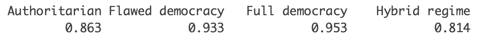
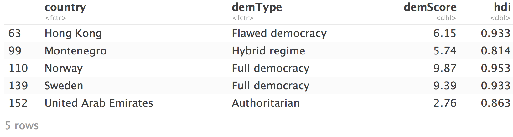
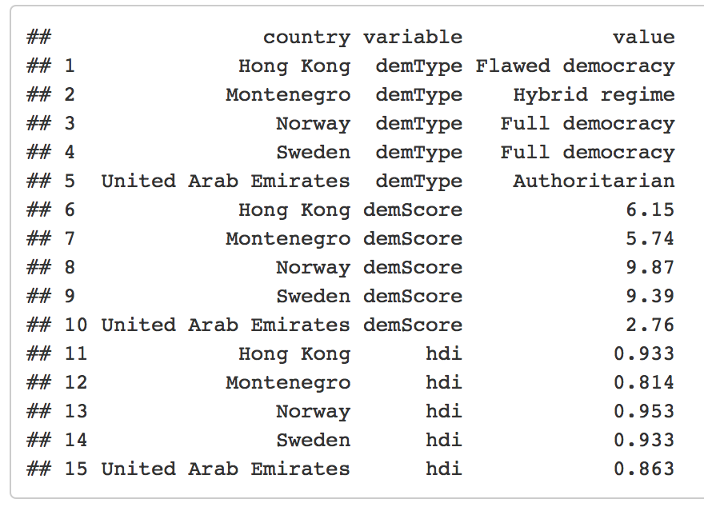

<br> 
<center></center>


## Course: Data-Driven Management and Policy

### Prof. José Manuel Magallanes, PhD 

_____

# Session 4 LAB: Working with Data Frames


#Lab Instructions

## Part 1:

You saw this code in the session:

```{r, eval=TRUE}
# one input, and several output in simple data structure:
factors=function(number){
    # empty vector that will collect output
    vectorOfAnswers=c()
    
    # for every value in the sequence...
    for (i in 1:number){
        
        #if the remainder of 'number'/'i' equals zero...
        if ((number %% i) == 0){ 
            
            # ...add 'i' to the vector of factors!
            vectorOfAnswers=c(vectorOfAnswers,i)
    }
  }
  return (vectorOfAnswers) # returning  the vector
}
```

This function accepted an integer number and returned its factors. Please answer these questions:

1. For any number **N**, how many times does the **for** section is executed to compute the factos of **N**?

2. Make a change in the code to reduce the times the **for** section is executed.


## Part 2:

Open the file *demo_hdi*, it is a csv file in the folder you downloaded. Then,

* Get the max value of _human development index_ for each type of democracy. 

You should get something like this:

 


* Use those values to select the rows whose hdi matches one of those. 

You should get something like this:



* Turn that wide format into a long format. 

You should get something like this:




## Final project reminder:

1. Keep collecting data (and start if you haven't). 

2. Be ready to start your experiment soon.


----

* [Go to page beginning](#beginning)
* [Go to Course schedule](https://ds4ps.org/ddmp-uw-class-spring-2019/schedule/)
