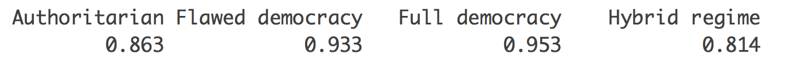
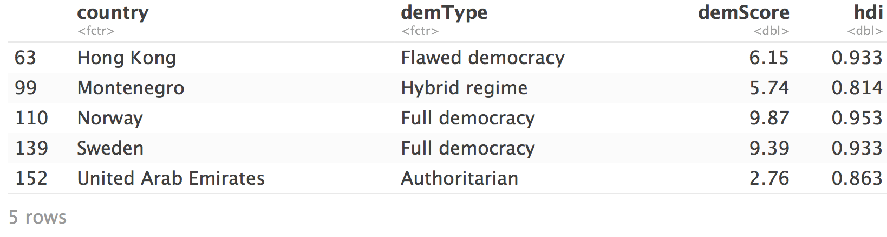
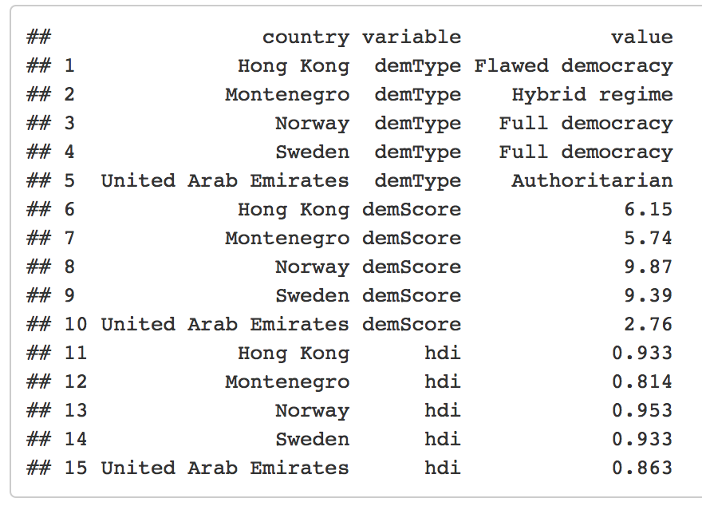

<br> 
<center></center>


## Course: Data-Driven Management and Policy

### Prof. José Manuel Magallanes, PhD 

_____

# Session 3 LAB: Data Structures


#Lab Instructions

## Part 1:

Open the file *demo_hdi*, it is a csv file in the folder you downloaded. Then,

* Get the max value of _human development index_ for each type of democracy. You should get something like this:

 


* Use those values to select the rows whose hdi is that one. You should get:



* Turn that wide format into a long format:



```{r}
demo_hdi=read.csv("demo_hdi.csv")
```

```{r}
v=tapply(X=demo_hdi$hdi,
       INDEX=list(demo_hdi$demType),
       FUN=max)
```

```{r}
demo_hdiW=demo_hdi[demo_hdi$hdi %in% v,]
```

```{r}
library(reshape2)
melt(demo_hdiW,id.vars=c('country'))
```

----

* [Go to page beginning](#beginning)
* [Go to Course schedule](https://ds4ps.org/ddmp-uw-class-spring-2019/schedule/)
